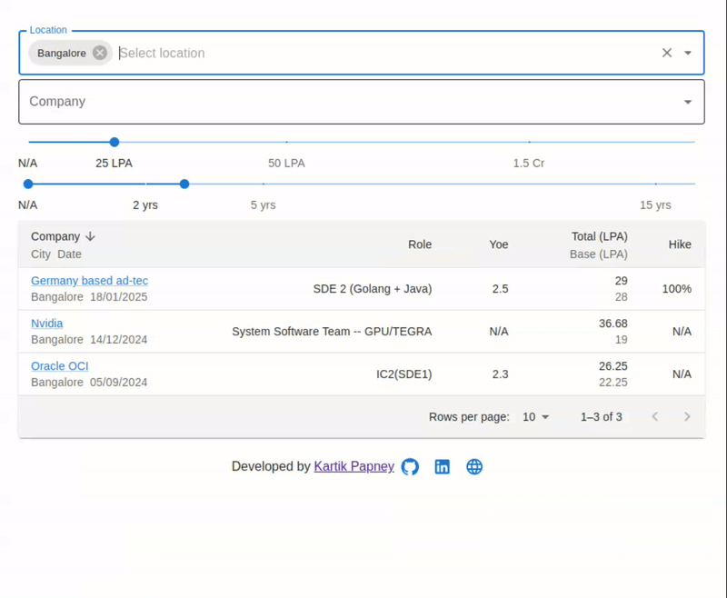
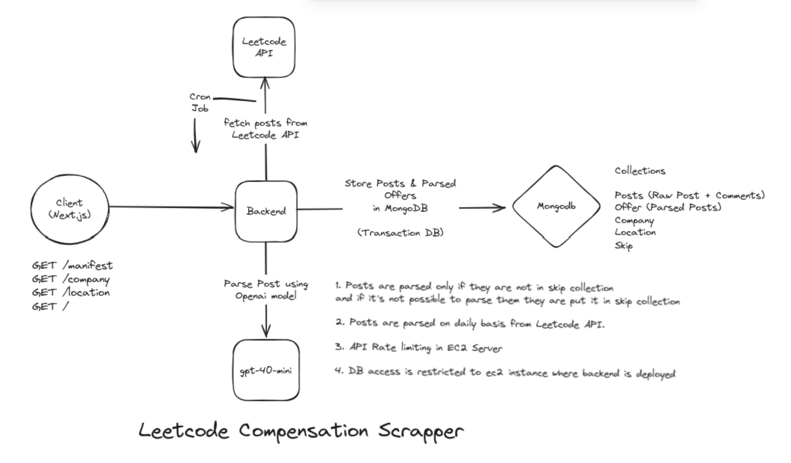

# About The Project

The Compensation project is a platform designed specifically for Software Engineers to visualize and analyze data from the Leetcode Compensation section. It leverages the capabilities of OpenAI's GPT-4-mini model, the platform parses user-submitted posts and extracts actionable insights, making it easier for engineers to explore salary trends, compensation packages, and market data.

  
   <i>The above diagram illustrates a demo of the Compensation platform.</i>

# Key Features:

<ul>
    <li>
    <b>Automated Data Parsing:</b> Uses cronjob to periodically fetch posts from Leetcode and structures the information using Open AI model.
    </li>
    <li>
    <b>Insightful Visualizations:</b> Provides clear and interactive data visualizations to help users understand compensation trends.
    </li>
    <li><b>Customizable Filters:</b> Allows filtering and sorting by key criteria like years of experience, location, and compensation.</li>
</ul>

# High Level Design

  
    <i>The above diagram illustrates the architecture and flow of the Compensation platform.</i>

